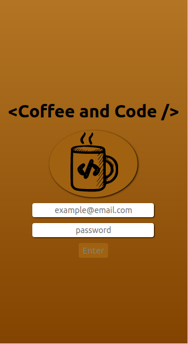

# Coffe and Code

  
Coffe and Code é uma aplicação web para smartphones, nele é possível fazer buscas de receitas para comidas, bebidas, favorita-las e acompanhar o progresso de sua receita.

  
  

---

## Projeto proposto pela Trybe

A Trybe propôs um projeto em equipe onde nosso código seria submetido ao avaliador automático cypress, onde tivémos uma sprint de duas semanas para finalizar, tívemos 87 requisitos para fechar 100% do avaliador. 

---

## Mão na massa

Utilizamos o Trello para por em prática, o framework escolhido foi o kanban, onde nosso backlog foi separado em várias colunas de páginas, além das colunas para estilização e de PR. O projeto foi feito em react hooks com context API para gerenciar os estados, foi feito a utilização do react-router-dom para gerenciar as rotas.

---
